# Jarkom-Modul-1-2026-K-08

<div align="center">


</div>

<div align="center">


</div>

<div align="center">


</div>

---

<div align="center">

| Nama | NRP |
|:-------:|:------:|
| **Muhammad Rafi Pramudya Putra** | `5027251024` |
| **Alif Ramzy Pasha Firdaus** | `5027251121` |
</div>


## 1. Setup Topologi
Setting masin masing ip sesuai pembagian dan setting resolve dns nya 
```
ip addr add 192.168.122.10/24 dev eth0
echo "nameserver 8.8.8.8" > /etc/resolv.conf
```
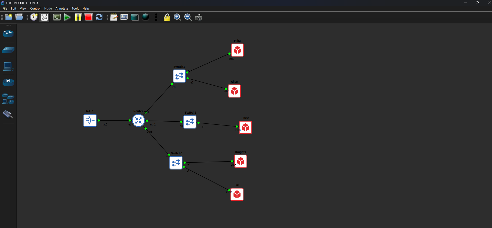

## 2. Setup dhcp untuk eth0 route  
setting dhcp untuk router
```
iface eth0 inet dhcp
```
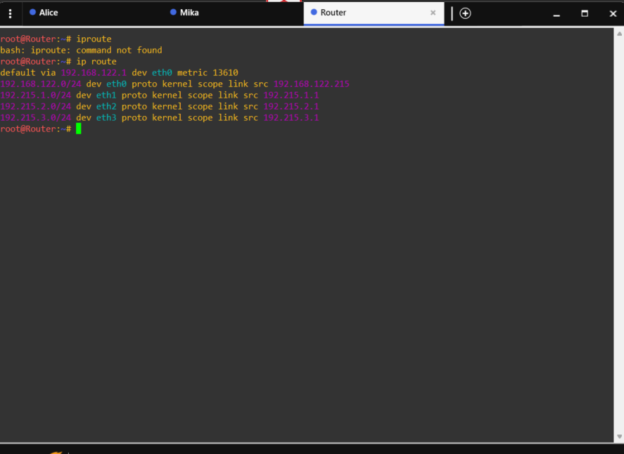

## 3. Cek koneksi
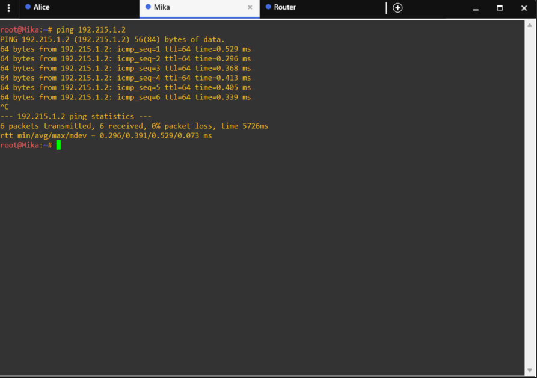

## 4. setting router agar  bisa resolve dns 

Setting router agar resovle dns google dan agar dapat terhubung ke dalam internet

```
sysctl -w net.ipv4.ip_forward=1
iptables -t nat -A POSTROUTING -o eth0 -j MASQUERADE
echo "nameserver 8.8.8.8" > /etc/resolv.conf
```

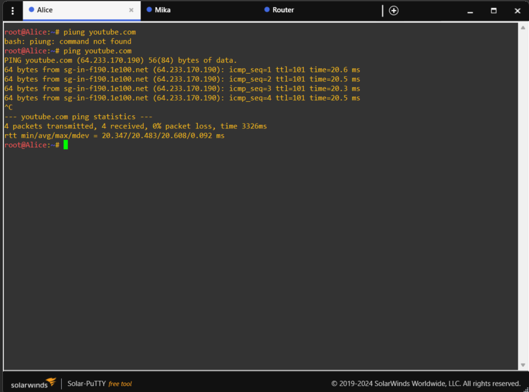

## 5. Script cek status
tulis menggunakan bash pada /root/cek_status.sh

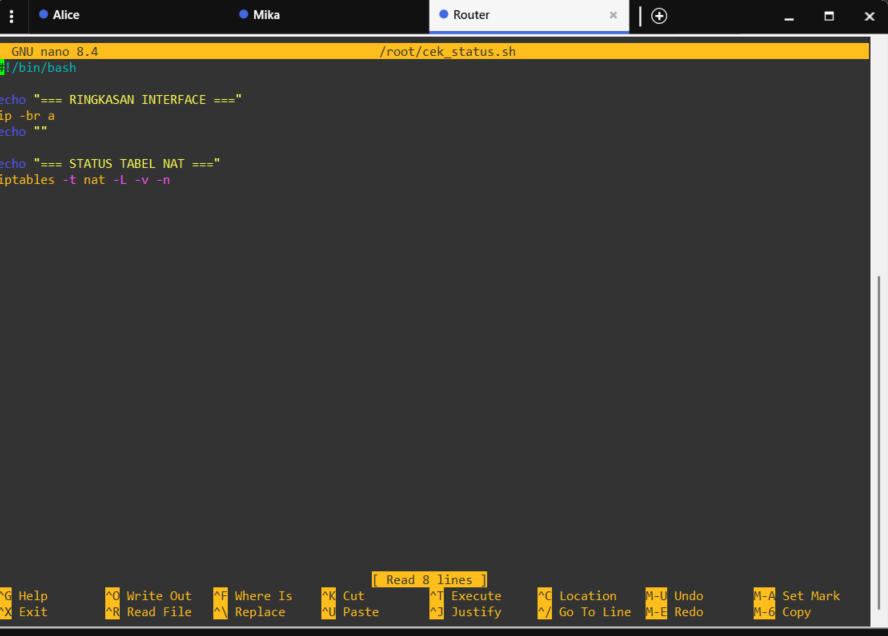
hasil cek status 
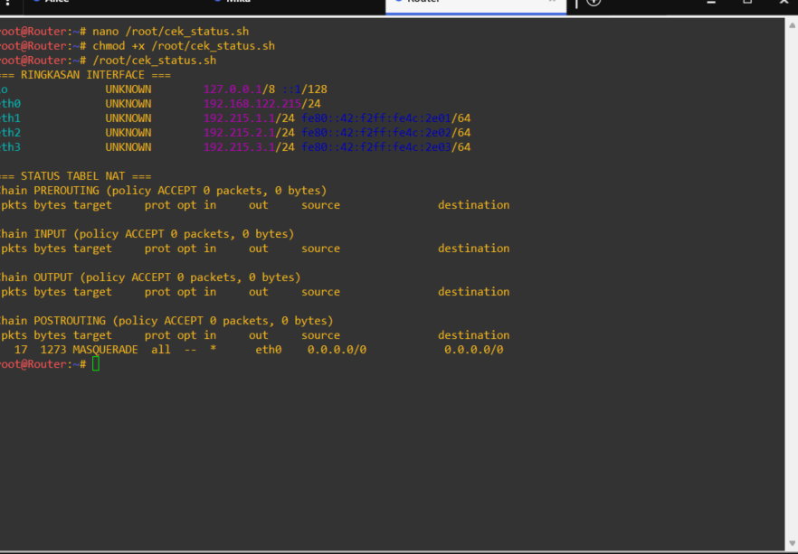

## 6. Anomali Traffic Wireshark
Memulai capture wireshark

Menjalankan Traffic Generator

Memasukkan file traffic_protocol ke wiresharknya (https://drive.google.com/drive/folders/1ZjFvWIjvAQAjE9pPthm7V_bGyaSt93lY?usp=sharing)

Terapkan Display Filter
```
icmp or dns
```
<!-- ---------------------------------------- Gambar ------------------------------------ -->

## 7. Ftp server

membuat shared folder dan install vsftp
```
apt update && apt install vsftpd -y
mkdir -p /var/wired/data
```

setting alice untuk read and write dengan cara setting kepimilikan alice

```
useradd -m -d /var/wired/data alice
passwd alice
chown alice:alice /var/wired/data
```
setting eiri agar di blacklist

```
useradd -m -d /var/wired/data eiri
passwd eiri
echo "eiri" >> /etc/vsftpd.userlist
```
tambahkan user mika dan kita set folder agar untuk permission other hanya boleh read
```
chmod 755 /var/wired/data
```
lalu tambahkandonfig ini nano /etc/vtspd.conf

```
write_enable=YES
chroot_local_user=YES
allow_writeable_chroot=YES
user_sub_token=$USER
local_root=/var/wired/data
userlist_enable=YES
userlist_file=/etc/vsftpd.userlist
userlist_deny=YES
listen=YES
listen_ipv6=NO
anonymous_enable=NO
local_enable=YES
dirmessage_enable=YES
use_localtime=YES
xferlog_enable=YES
connect_from_port_20=YES
secure_chroot_dir=/var/run/vsftpd/empty
pam_service_name=vsftpd
rsa_cert_file=/etc/ssl/certs/ssl-cert-snakeoil.pem
rsa_private_key_file=/etc/ssl/private/ssl-cert-snakeoil.key
ssl_enable=NO
chown_uploads=NO
chmod_enable=YES
```
akses dari alice , sebelum itu install dulu 

```
apt install ftp -y
```
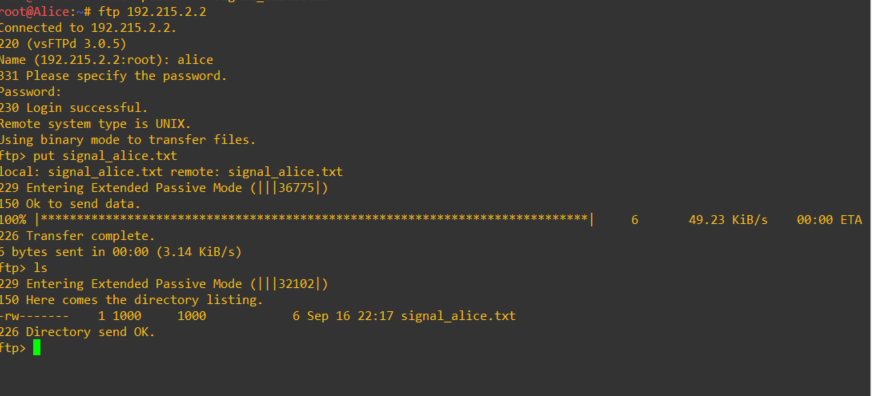

login sebagai eiri
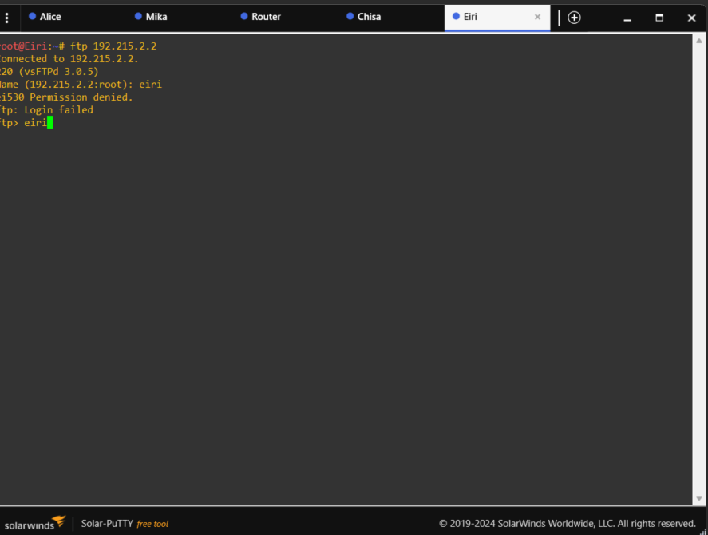

## 8. Analisa file yang dikirim knight 

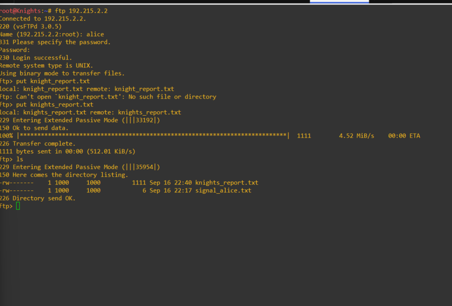
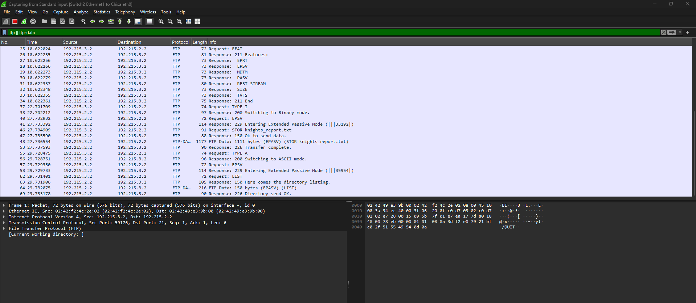
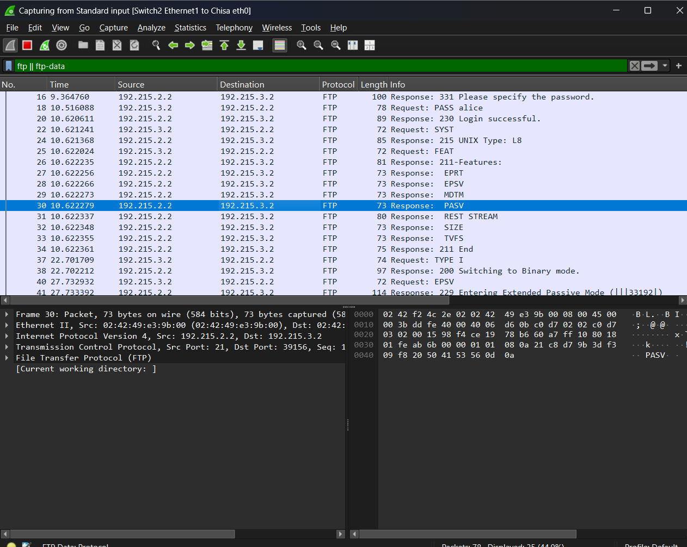

## 9. Pembuktian mika tidak bisa melakukan write

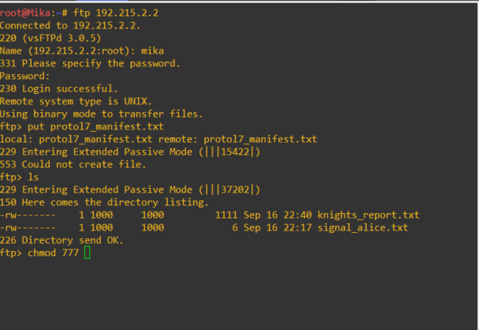

file capture dari jaringan chisa

## 10. Analisis paket uji ketahanan ke chisa

kirim 
```
ping -c 77 -s 128 -i 0.3 129.215.2.2
```
jalankan filter pada wireshark
icmp

Analisa ICMP Type dan code request
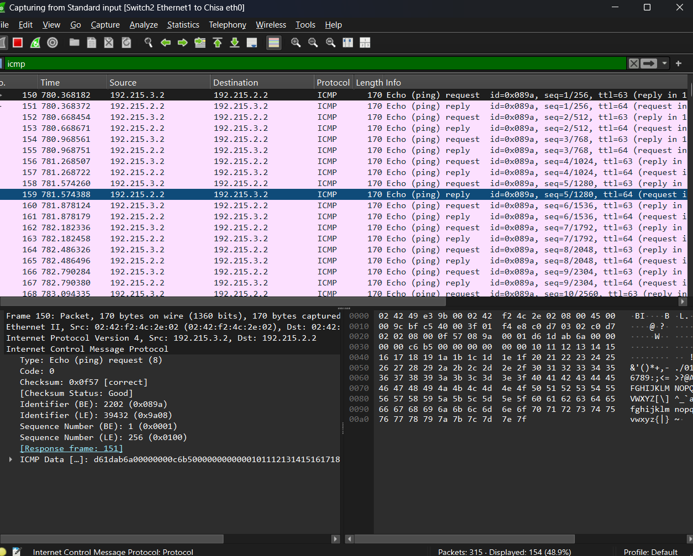

Analisa ICMP Type dan code reply
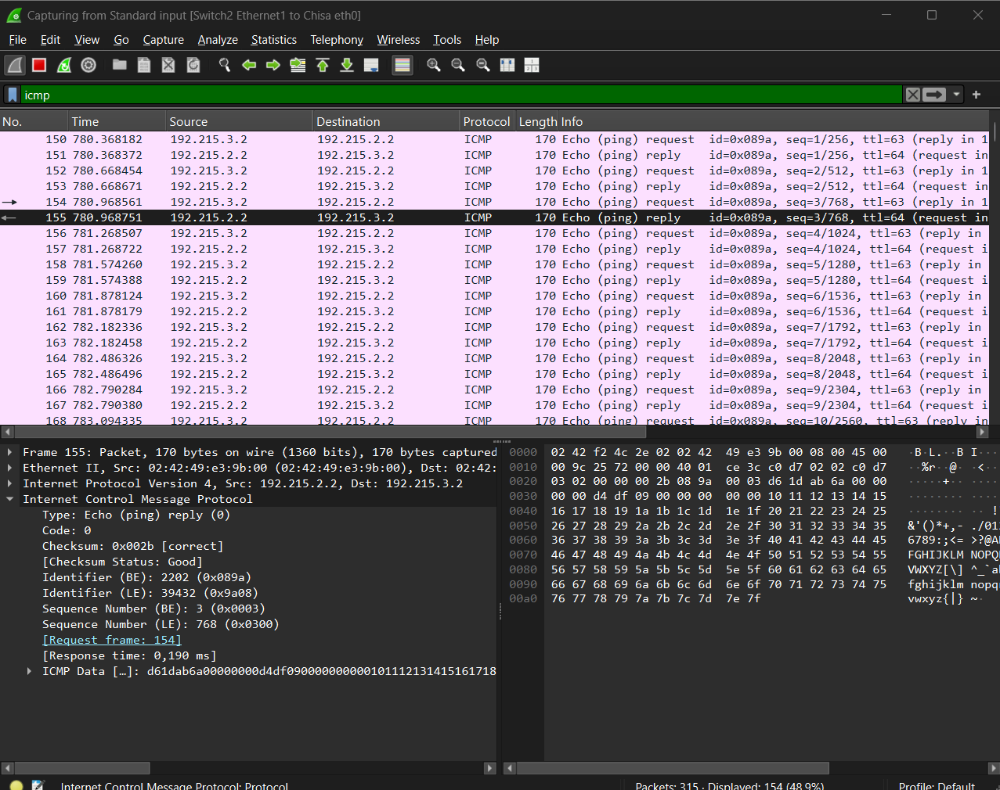

Analisis packet loss dan RTT
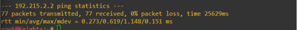
## 11. Analisis Telnet & Credential Sniffing
Membuktikan bahwa protokol Telnet mengirimkan data (termasuk username dan password) secara plaintext (teks terbuka) sehingga mudah disadap.

Pertama install Telnet Server pada node target (misal: Chisa 192.168.2.2)
```
apt update && apt install telnetd -y
```
Kedua buat Akun Pengguna di server tersebut
```
adduser phantom_user
Lalu masukkan password, misal: wired_ghost
```
Ketiga lakukan Koneksi Telnet dari node lain (misal: Alice)
```
telnet 192.168.2.2
```
Keempat masukkan username (phantom_user) dan password (wired_ghost)

```
Filter Wireshark: telnet
```

Kesimpulan
```
Terlihat jelas bahwa username dan password terbaca secara utuh dalam bentuk teks terbuka tanpa enkripsi apa pun, yang menunjukkan kerentanan fatal pada protokol Telnet.
```

## 12. Port Scanning & Analisis TCP Flag
Mengidentifikasi port terbuka dan tertutup pada node Knights menggunakan Netcat serta menganalisis perbedaan TCP Flag di Wireshark.

Pertama jalankan perintah pemindaian port pada Knights (192.215.3.2)
```
nc -z -v 192.215.3.2 22 80 7777
```
```
Filter Wireshark: tcp.port == 22 or tcp.port == 80 or tcp.port == 7777
```
Penjelasan
```
Port Terbuka (22 & 80): Saat Alice mengirim paket [SYN], Knights membalas dengan bendera [SYN, ACK], menandakan layanan aktif dan menerima koneksi.

Port Tertutup (7777): Saat Alice mengetuk port 7777, Knights membalas dengan bendera [RST, ACK] (Reset), menandakan koneksi ditolak secara tegas karena tidak ada aplikasi yang listening di port tersebut.
```

## 13. Passwordless SSH & Key Exchange Analysis
Mengganti autentikasi berbasis password dengan kunci kriptografi (Public Key) serta membuktikan keamanan SSH melalui proses Key Exchange.

Pertama di Node Knights: Buat user mika_admin, lalu edit konfigurasi SSH
```
adduser mika_admin
nano /etc/ssh/sshd_config
```
Lalu ubah baris PasswordAuthentication yes menjadi PasswordAuthentication no, lalu simpan. Restart layanan SSH
```
service ssh restart
```
Kedua di Node Mika: Buat user yang sama, buat pasangan kunci, lalu kirimkan ke Knights
```
adduser mika_admin
su - mika_admin
ssh-keygen
# (Tekan Enter 3 kali tanpa passphrase)
ssh-copy-id mika_admin@192.215.3.2
# (Masukkan password sementara akun mika_admin di Knights)
```
Ketiga uji coba
```
ssh mika_admin@192.215.3.2
```
```
Filter Wireshark: ssh
```
Penjelasan
```
Tangkap paket Protocol Version Exchange dan Key Exchange Init. Kredensial tidak terlihat dalam teks terbuka karena seluruh sesi langsung dienkripsi menggunakan kunci simetris yang dinegosiasikan melalui proses Diffie-Hellman Key Exchange di awal koneksi.
```

## 14. Forensik PCAP Brute Force & Validasi Soket
Menganalisis file tangkapan serangan brute-force HTTP POST, mengidentifikasi kredensial yang jebol, dan melakukan validasi otomatis.

Langkah Analisis (Wireshark)
```
1. Buka file wired_bruteforce.pcapng di Wireshark.

2. Filter menggunakan: http.request.method == "POST".

3. Temukan IP Penyerang (172.26.7.50), IP Target (172.26.7.100), dan Port (8080).

4. Periksa paket POST terakhir yang dibalas dengan status 200 OK (bukan 401 Unauthorized). Buka detail paket tersebut untuk melihat payload username (lain_admin) dan password (wired_pr0cotol_7).

5. Cek paket respons 200 OK untuk melihat versi web server pada baris Server (Apache/2.4.62).
```
Langkah validasi soket

Pertama jalankan perintah Netcat di console Router/Alice
```
nc 10.4.89.246 3401
```
Kedua masukkan data sesuai urutan pertanyaan
```
Attacker IP: 172.26.7.50

Target IP & Port: 172.26.7.100:8080

Password: wired_pr0cotol_7

Web Server & Version: Apache/2.4.62
```
Ketiga dapatkan flag validasi akhir
```
KOMJAR26{W1r3d_Brut3_H0yZsExJta1BCs3ArnWVuPx21}
```
## 15. Analisa koneksi keyboard
1. Mencari vendor id dari HID Device

dengan cara menambahkan filter dibawah ini yang berguna untuk meihat informasi device yang dicolokkan
```
   usb.bDescriptorType == 1
```
   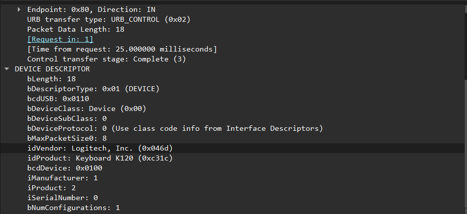
terlihat Vendor ID nya `0x046d` dan Product ID `0xc31c`

2. Usb device addr yang terdaftar ke keyboard 

filter dengan
```
usb.capdata
```
dan terlihat device addres nya adalah `7`

3. Mengambil keystroke dengan tshark dibawah ini 
   tshark -r soal15.pcap -Y "usb.capdata" -T fields -e usb.capdata

```
02001a0000000000
0000000000000000
00000c0000000000
0000000000000000
0000150000000000
0000000000000000
0000080000000000
0000000000000000
0000070000000000
0000000000000000
02002d0000000000
0000000000000000
0200130000000000
0000000000000000
0000150000000000
0000000000000000
0000120000000000
0000000000000000
0000170000000000
0000000000000000
0000120000000000
0000000000000000
0000060000000000
0000000000000000
0000120000000000
0000000000000000
00000f0000000000
0000000000000000
02002d0000000000
0000000000000000
0000240000000000
0000000000000000
02002d0000000000
0000000000000000
00000c0000000000
0000000000000000
0000160000000000
0000000000000000
02002d0000000000
0000000000000000
0000040000000000
0000000000000000
00000f0000000000
0000000000000000
00000c0000000000
0000000000000000
0000190000000000
0000000000000000
0000080000000000
0000000000000000
02002d0000000000
0000000000000000
00001f0000000000
0000000000000000
0000270000000000
0000000000000000
00001f0000000000
0000000000000000
0000230000000000
0000000000000000
```

`Wired_Protocol_7_is_alive_2026`

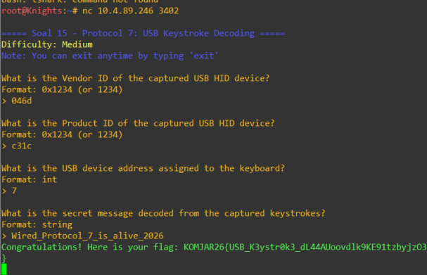
# 16. Analisa malware yang dikirim knights_agent

1. cek ip penyerang dengan memfilter request command download

```
ftp.request.command == "RETR"
```

terlihat ip server 198.51.100.7
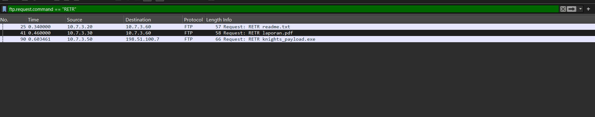
2. untuk melihat banner apa yang ditampilkan server dengan follow tcp stram pada row packet pengiriman malware
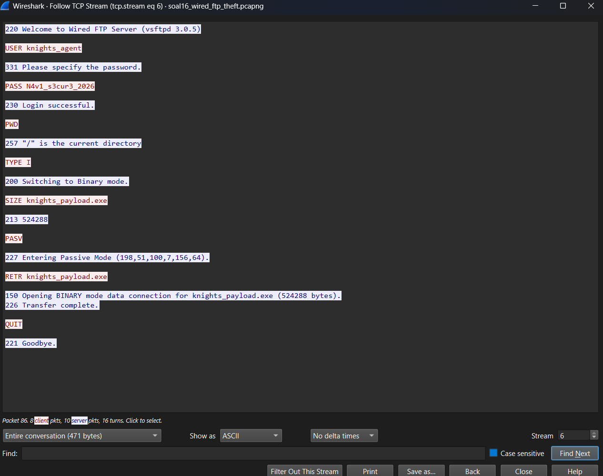
vsftpd 3.0.5

3. Melihat username dan password yang digunakan penyerang pada follow tcp tadi 

```
USER knights_agent

331 Please specify the password.

PASS N4v1_s3cur3_2026
```

4. Melihat size paket malware tadi dari tcp stream tadi dan didapatkan 

```
SIZE knights_payload.exe

213 524288

```
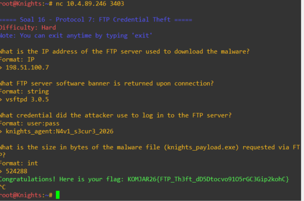
 KOMJAR26{FTP_Th3ft_dD5Dtocvo91O5rGC3Gip2kohC}


# 19. analisa file SMTP

 1. Email dari korban 

pertama tama kita perlu  memfilter dari protocol smtp saja lalu menggunakan fitur tcp stream untuk melihat apa saja yang dikirim 

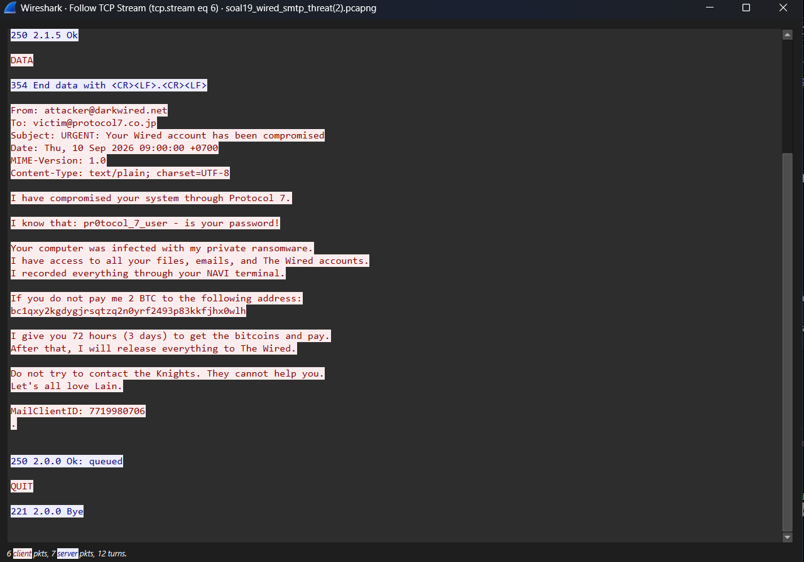

terlihat dari TCP stream tersebut  email korman adalah `victim@protocol7.co.jp`

2. Pasword korban 

dari gambar tersebut terlihat password korban adalah `pr0tocol_7_user`

3. Tipe malware
`ransomware`

4. Tenggat dalam hari
`3`

5. Mail client ID
`7719980706`

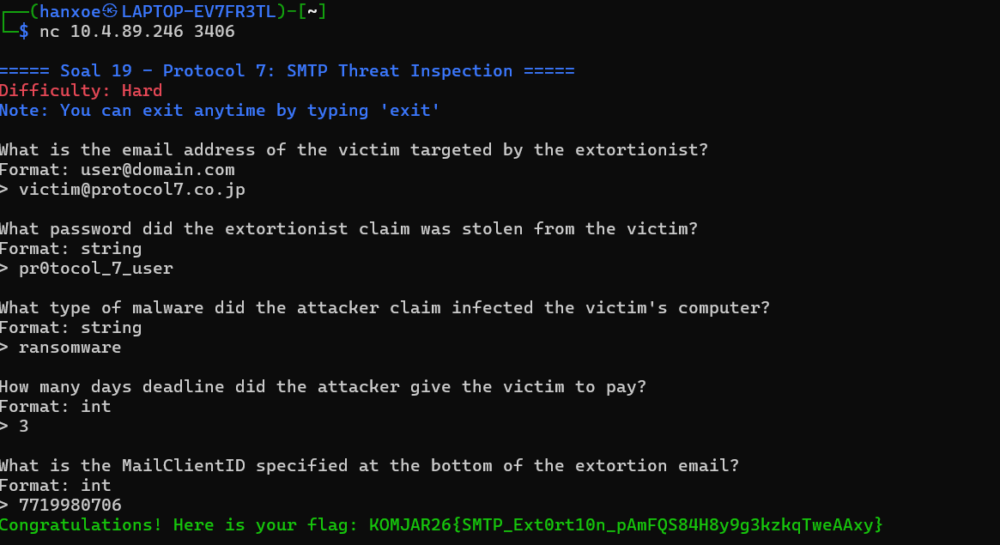


# 20 Analisa file enkripsi TLS

1. versi dari TLS 

Disini kita tinggal klik salah satu paket lalu lihat pada Transport layer security nya
 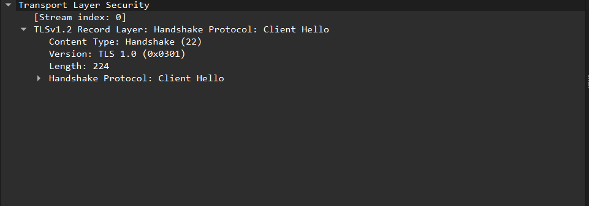

2. Nama host yang dituju client 
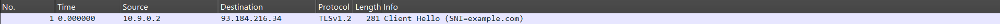

3. IP address HTTPS server
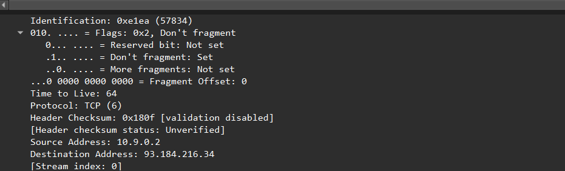

4. user agent dari HTTP
decrypte terlebih dahulu row paket dengan kunci yang sudah dikirim , lalu pada HTTP stream akan terlihat user agent dan HTTP request methode nya 
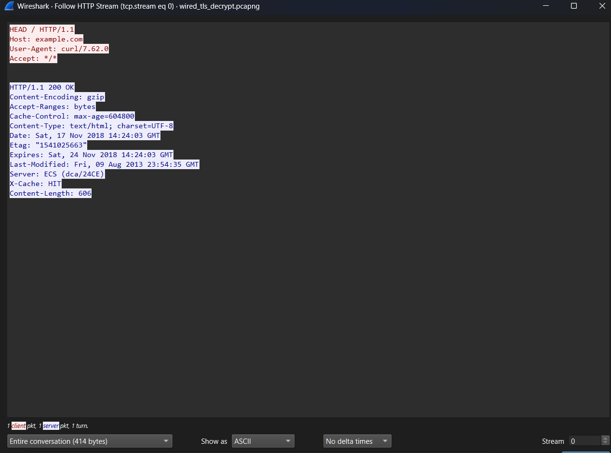

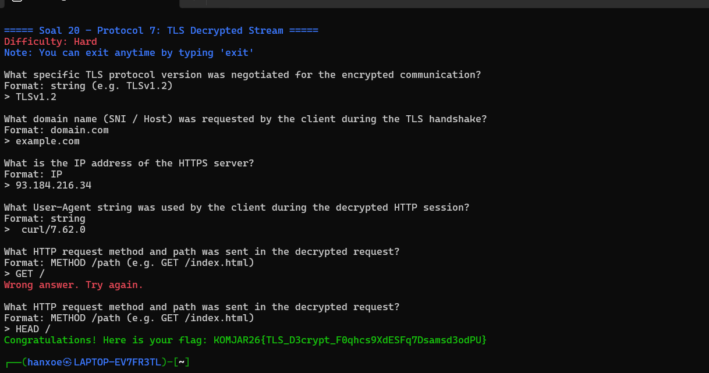

## Issue

### waktu tidak sinkron
solusi ubah dan samakan waktu supaya bisa menginstall package

```
curl -sI https://www.google.com | grep -i ^date:
// date: Wed, 16 Sep 2026 09:03:34 GMT 
date -s "Wed Sep 16 09:04:00 UTC 2026"
Wed Sep 16 09:04:00 UTC 2026
root@Alice:~# date -u

```
