### for tomoro 
auto eth0
iface eth0 inet dhcp
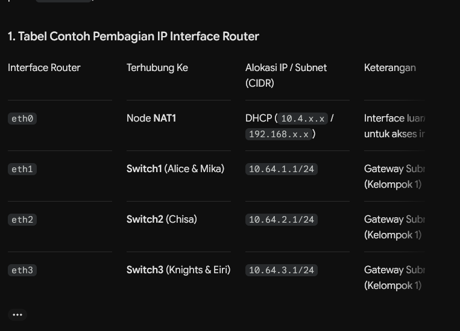
### add ip addr for device interface (debinet)
ip addr add 192.168.122.10/24 dev eth0

### add ip addr for device interface (Vpcs)
ip 192.168.1.10/24 192.168.1.1

### setting gateway 
ip route add default via 192.168.122.1

### forwarded Ip
sysctl -w net.ipv4.ip_forward=1

### expose private network to acces network
iptables -t nat -A POSTROUTING -o eth0 -j MASQUERADE

### set up dns in client 
echo "nameserver 8.8.8.8" > /etc/resolv.conf

## set up router sh
nano /root/cek_status.sh
```
#!/bin/bash
echo "=== Interface Summary ==="
ip -br a

echo ""
echo "=== NAT Table Status ==="
iptables -t nat -L -v -n
```
chmod +x /root/cek_status.sh


### setup network interface automatic
nano /etc/network/interfaces

```
auto lo
iface lo inet loopback

# eth0 -> ke internet (Cloud/NAT)
auto eth0
iface eth0 inet dhcp
    up echo nameserver 8.8.8.8 > /etc/resolv.conf
    up sysctl -w net.ipv4.ip_forward=1
    up iptables -t nat -A POSTROUTING -o eth0 -j MASQUERADE

# eth1 -> Switch1 (Alice, Mika)
auto eth1
iface eth1 inet static
    address 192.168.1.1
    netmask 255.255.255.0

# eth2 -> Switch2 (Chisa)
auto eth2
iface eth2 inet static
    address 192.168.2.1
    netmask 255.255.255.0

# eth3 -> Switch3 (Knights, Eiri)
auto eth3
iface eth3 inet static
    address 192.168.3.1
    netmask 255.255.255.0
```

### reboot 

```
ip link set eth0 down
ip link set eth0 up

ip link set eth1 down
ip link set eth1 up

ip link set eth2 down
ip link set eth2 up

ip link set eth3 down
ip link set eth3 up
```

### set client presistance 

```
auto lo
iface lo inet loopback

auto eth0
iface eth0 inet static
    address 192.168.1.10
    netmask 255.255.255.0
    gateway 192.168.1.1
    up echo nameserver 8.8.8.8 > /etc/resolv.conf
```

### Mika problem
 wget -O pcap.zip  'https://drive.google.com/uc?export=download&id=1G9zIi20ofbOgfffor-i-e7QKU3Ihe42W'

install zip file and run , and wireshark

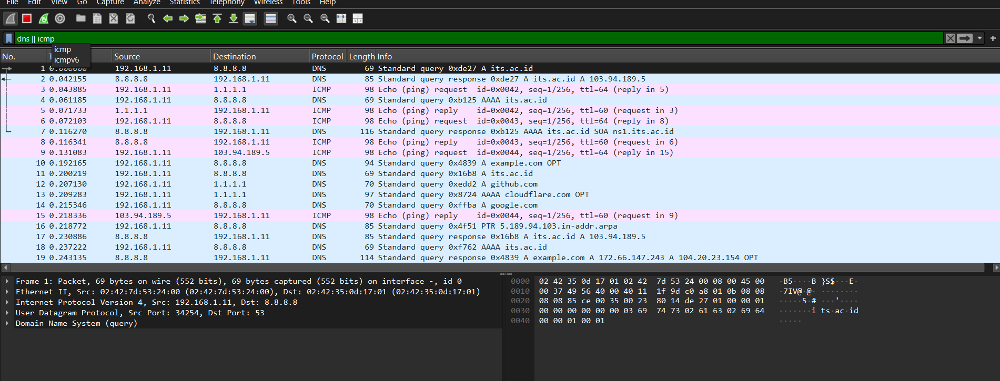

### chisa problem ( vsFtpd setup )
install ftpd
apt update && apt install vsftpd -y
mkdir -p /var/wired/data
useradd -m -d /var/wired/data alice
passwd alice


useradd -m -d /var/wired/data mika
passwd mika


useradd -m -d /var/wired/data eiri
passwd eiri


## setup permission  untuk si alice 
root@Chisa:~# chown alice:alice /var/wired/data

## setup blacklist userlist

root@Chisa:~# echo "eiri" >> /etc/vsftpd.userlist

## edit config 


root@Chisa:~# nano /etc/vtspd.conf

```
write_enable=YES
chroot_local_user=YES
allow_writeable_chroot=YES
user_sub_token=$USER
local_root=/var/wired/data
userlist_enable=YES
userlist_file=/etc/vsftpd.userlist
userlist_deny=YES
listen=YES
listen_ipv6=NO
anonymous_enable=NO
local_enable=YES
dirmessage_enable=YES
use_localtime=YES
xferlog_enable=YES
connect_from_port_20=YES
secure_chroot_dir=/var/run/vsftpd/empty
pam_service_name=vsftpd
rsa_cert_file=/etc/ssl/certs/ssl-cert-snakeoil.pem
rsa_private_key_file=/etc/ssl/private/ssl-cert-snakeoil.key
ssl_enable=NO
chown_uploads=NO
chmod_enable=YES
```

### and restart
 service vsftpd restart
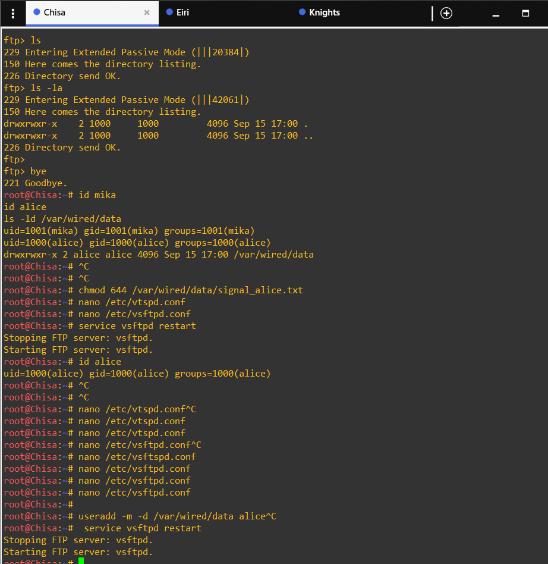
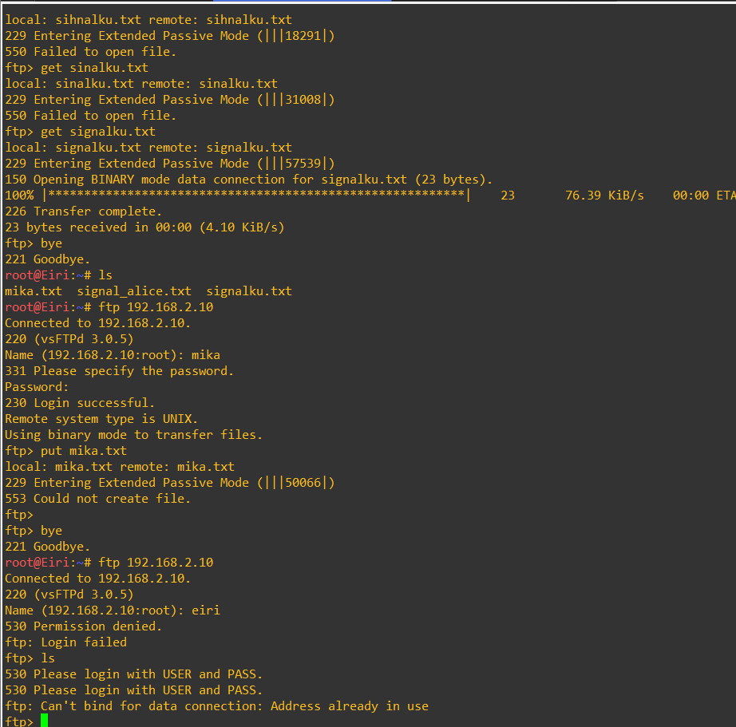

## Knight problem 

## download and upload via alice account
wget -O knights.zip 'https://drive.google.com/uc?export=download&id=1lFepK4wFmx55PnRki3NsHW-ivudSR0vg'

## tracking ireshark 
ftp || ftp-data
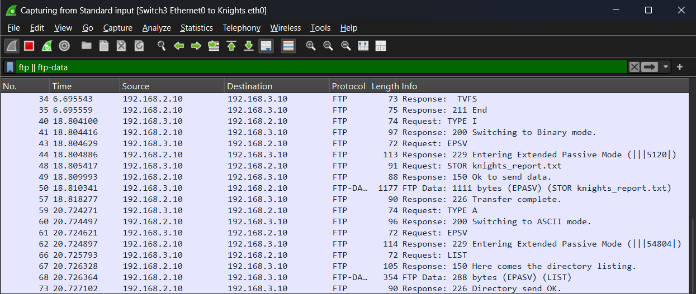

### bukti mika tidak bisa upload
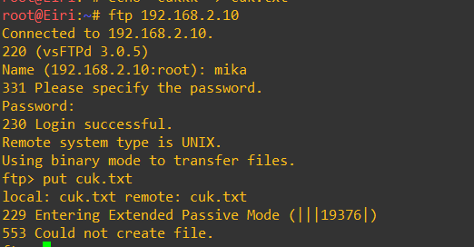


##  serangan knights 
ping -c 77 -s 128 -i 0.3 192.168.2.10
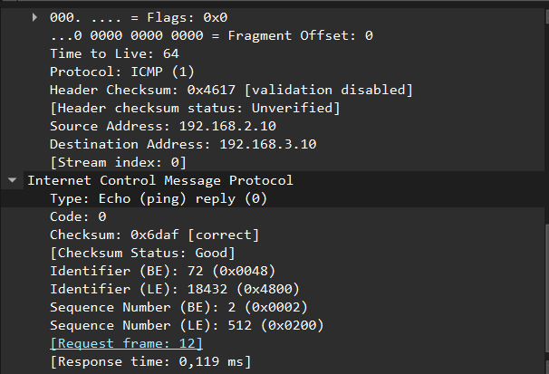
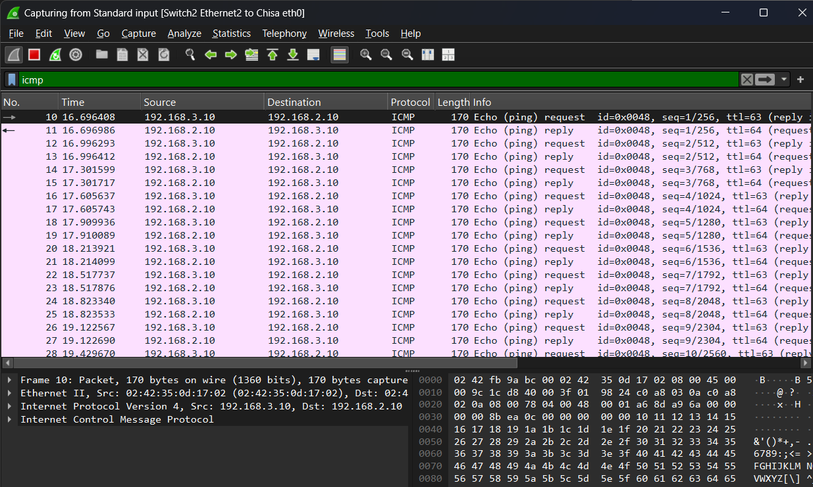
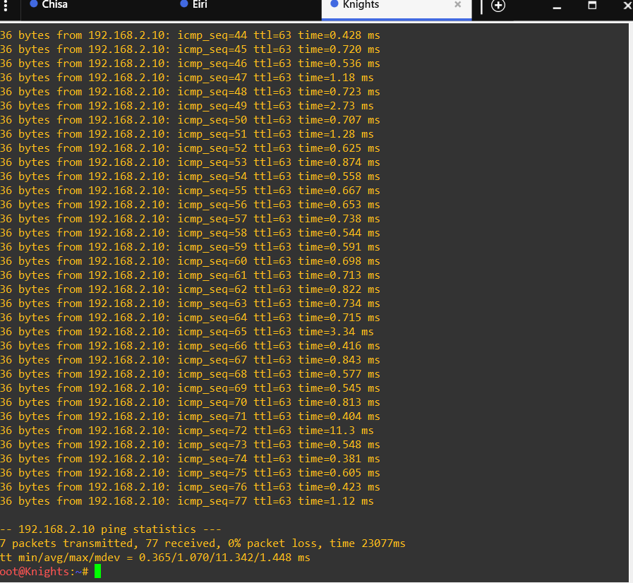
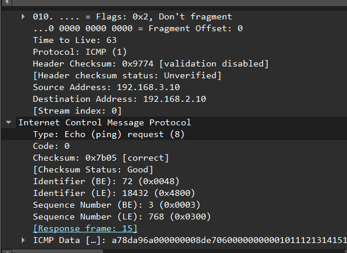
<!-- -c 77     → kirim 77 paket
-s 128    → payload ICMP 128 bytes
-i 0.3    → interval antar paket 0,3 detik -->

## telnet
useradd -m phantom_user
passwd phantom_user
apt install inetutils-telnetd -y
nano /etc/inetd.conf

### nonaktif
#<off># telnet  stream  tcp  nowait  root  /usr/sbin/tcpd  /usr/sbin/telnetd

service openbsd-inetd restart
ss -lntp 
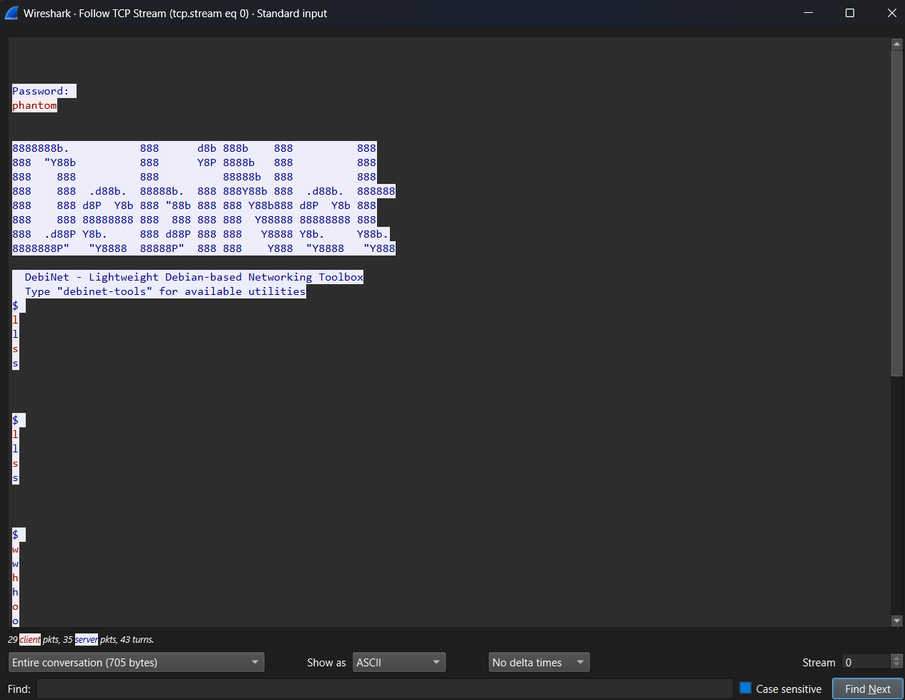

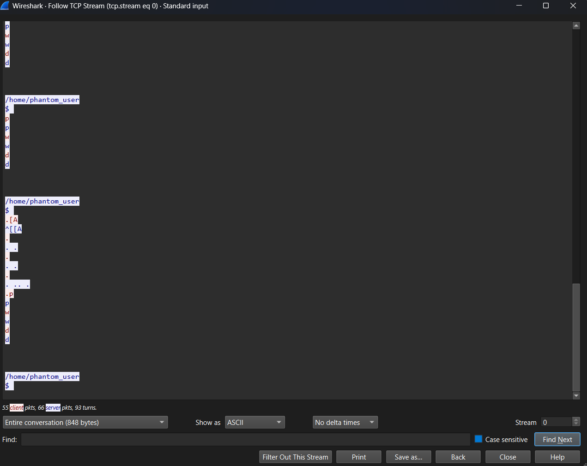

## nc port knight 

## buka dulu port
apt install openssh-server -y
service ssh start

apt install apache2 -y
service apache2 start
echo "Hello from Knights" > /var/www/html/index.html

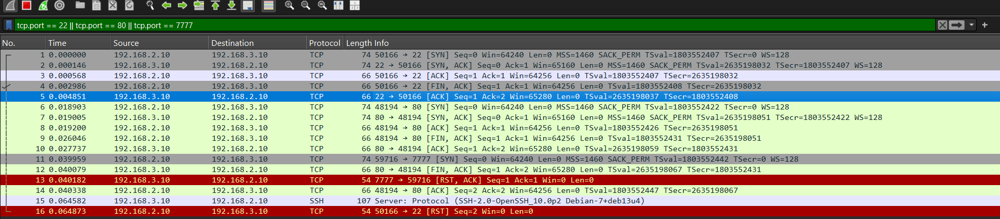
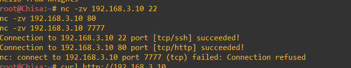
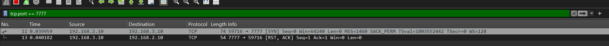
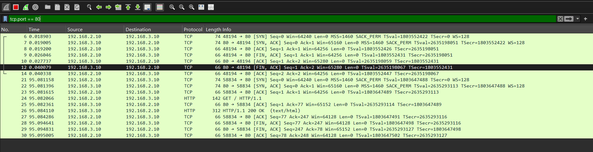
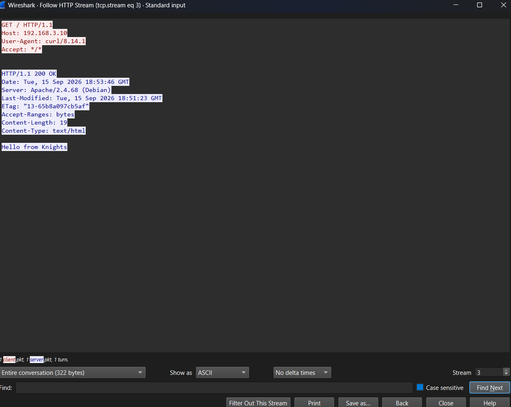

service ssh stop
service apache2 stop

## stup ssh via publick key


### dari sisi mika 
ssh-keygen -t ed25519
ls -la ~/.ssh/
cat ~/.ssh/id_ed25519.pub
ssh-ed25519 AAAAC3NzaC1lZDI1NTE5AAAA... mika@Mika
root@Mika:~# ssh mika_admin@192.168.3.10

### sisi knihths
useradd -m mika_admin
mkdir -p /home/mika_admin/.ssh
nano /home/mika_admin/.ssh/authorized_keys
chmod 700 /home/mika_admin/.ssh
chown -R mika_admin:mika_admin /home/mika_admin/.ssh
chmod 600 /home/mika_admin/.ssh/authorized_keys
chown -R mika_admin:mika_admin /home/mika_admin/.ssh

nano /etc/ssh/sshd_config
#PasswordAuthentication no
PubkeyAuthentication yes
service ssh restart

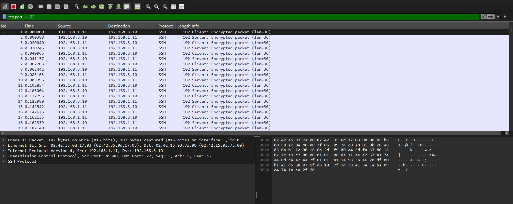
Berdasarkan hasil capture Wireshark, koneksi SSH dari node Mika ke node Knights diawali dengan TCP three-way handshake, kemudian dilanjutkan dengan Protocol Version Exchange dan Key Exchange. Pada tahap Key Exchange, client dan server melakukan negosiasi algoritma kriptografi serta membentuk kunci sesi yang digunakan untuk melindungi komunikasi selanjutnya. Setelah proses tersebut, paket SSH yang ditangkap Wireshark tidak menampilkan isi komunikasi dalam bentuk plaintext.

Berbeda dengan Telnet yang mengirimkan username dan password tanpa enkripsi sehingga kredensial dapat terlihat ketika dilakukan packet capture, SSH menggunakan mekanisme kriptografi untuk melindungi session. Pada konfigurasi ini autentikasi juga menggunakan public key dan PasswordAuthentication no, sehingga password tidak dikirimkan melalui jaringan sama sekali.

### brutoforce 
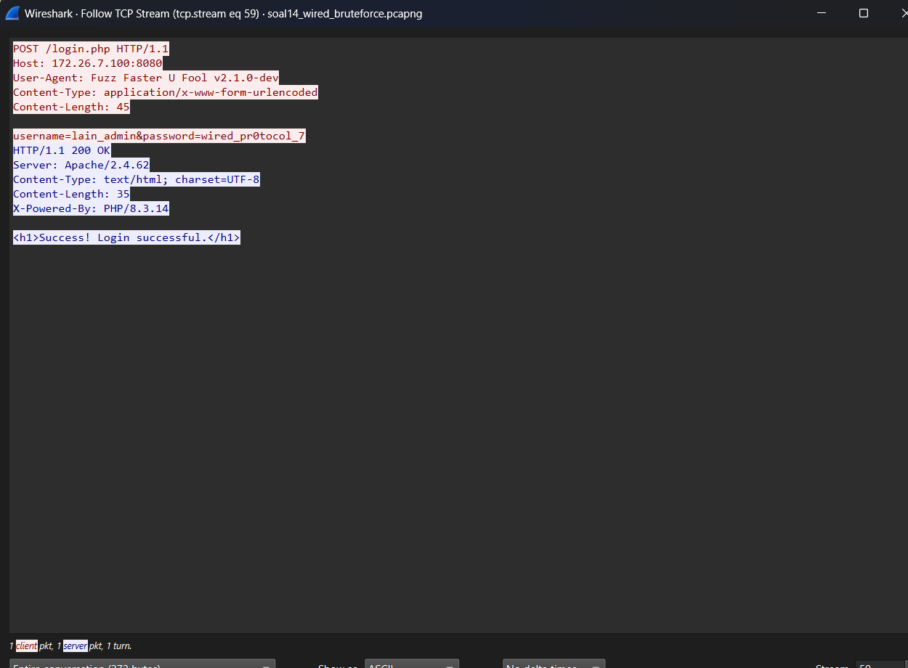